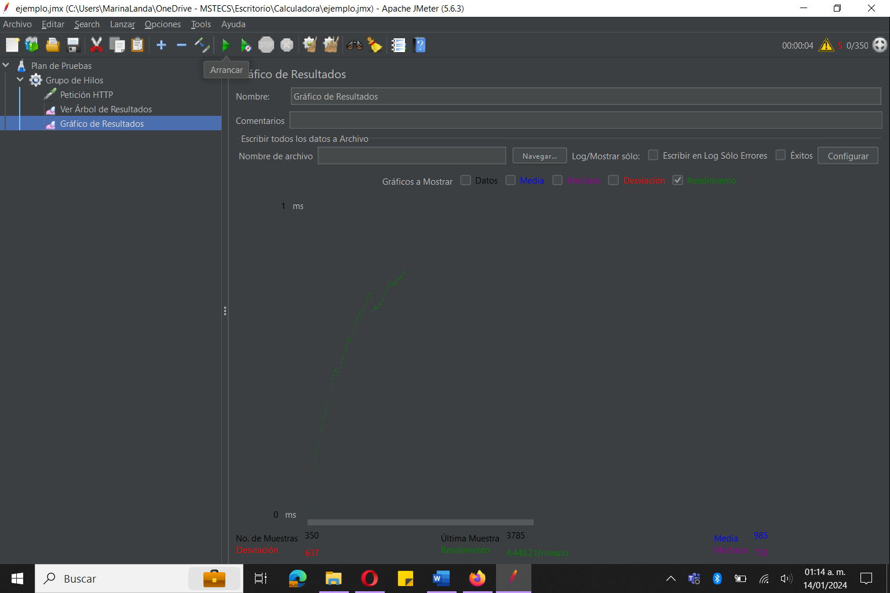

# CAPÍTULO 5. Pruebas de Carga y Rendimiento
## Práctica 5: Carga y rendimiento en página web
## Objetivo de la práctica: 
Al finalizar la práctica, serás capaz de:

- Evaluar la capacidad, resistencia y estabilidad de una página web bajo condiciones de carga y demanda, así como analizar el rendimiento, eficiencia y tiempos de respuesta de la aplicación de calculadora en diferentes escenarios y cargas de trabajo.

**Duración aproximada:**
- 40 minutos.

**Instrucciones:**

1.Abre **Apache JMeter**, con este se abrirá automáticamente en un plan de pruebas.

2.	**Añade un grupo de hilos.** 
2.1.	Da clic derecho sobre Plan de pruebas del menú de la izquierda. 
2.2.	Selecciona: **Añadir, Hilos (usuarios) y Grupo de hilos.**

3.	**Añade una petición HTTP.**
3.1.	Da clic derecho sobre **Grupo de hilos.**
3.2.	Selecciona: **Añadir, Muestreador y Petición HTTP.**

4.	**Configura la petición HTTP.** 
4.1.	Ingresa la información básica de: “**Nombre de servidor**” (URL): *iana.org* y “**Ruta**”: */domains* Esto significa que se accederá a la página: iana.org/domains 

5.	En un explorador abrimos el link *iana.org/domains* para verificar el acceso y la información. 

6.	 Hasta este momento, se ha añadido lo requerido para acceder a un link y realizar una prueba con cierta cantidad de usuarios (hilos), pero se requiere conocer los resultados. Para ello, se añaden receptores de información del link al que se desea someter a prueba. 
6.1. Da clic derecho sobre Grupo de hilos. 
6.2. Selecciona **Añadir, Receptor y Ver Árbol de Resultados.**

7.	Se ejecuta la primera prueba, del acceso de un usuario por un segundo realizando este proceso una sola vez.

7.1.	Se solicita guardar el plan de pruebas antes de lanzarlo. Selecciona **Yes.**

7.2.	Se guarda con el nombre: *ejemplo.jmx* y seleccionamos **Save.**

7.3.	Revisa los resultados, seleccionado **Árbol de resultados.** 
7.4.	Se mostrará una petición con resultado de muestreador y los datos de respuesta se mostrarán como el “código” del link al que se accedió.

8.	Selecciona en la pantalla de **Grupo de hilos**, el Número de hilos y aumenta a 350 y el período de subida (en segundos) a **10** y ejecuta nuevamente la prueba.

8.1.	Revisa los resultados, seleccionando **Árbol de resultados.** 
8.2.	Se mostrarán 350 peticiones con resultado de muestreador, y los datos de respuesta se mostrarán como el “código” del link al que se accedió.

9.	Cambia en la pantalla de **Grupo de hilos**, el período de subida (en segundos) a **90** y ejecuta nuevamente la prueba.

9.1.	Revisa los resultados, seleccionado **Árbol de resultados.** 
9.2.	Se mostrarán 350 peticiones con resultado de muestreador, y los datos de respuesta se mostrarán como el “código” del link al que se accedió. 

10.	Cambia en la pantalla de **Grupo de hilos**, el período de subida (en segundos) a “1” y ejecuta nuevamente la prueba.

10.1.	Revisa los resultados, seleccionado **Árbol de resultados.** 
10.2.	Se mostrarán 350 peticiones con resultado de muestreador, y los datos de respuesta se mostrarán como el “código” del link al que se accedió. Debido a lo rápido y a la saturación de carga, es posible que algunas cargas sean erróneas.

11.	**Añade otro receptor** 
11.1.	Da clic derecho en el grupo de hilos. 
11.2.	Selecciona: “añadir”, “Receptor” y “Gráfico de resultados”

12.	Limpia los datos del **Árbol de resultados**.  Da clic derecho sobre **Árbol de resultados** y selecciona Limpiar. Los datos deberán eliminarse.

13.	Realiza nuevamente pruebas validando el rendimiento de acuerdo con las variaciones de carga. Selecciona en la pantalla de **Grupo de hilos**, cambia el período de subida (en segundos) a **10** y ejecuta nuevamente la prueba.

13.1.	Revisa los resultados del **Árbol de resultados**. Se mostrarán 350 peticiones con resultado de muestreador, y los datos de respuesta se mostrarán como el “código” del link al que se accedió.

13.2.	Valida los resultados del **Gráfico de resultados**. Se mostrará una gráfica con el número de muestras, desviación, última muestra, rendimiento, media, mediana y los milisegundos en que se ejecutó.

14.	Limpia los datos del **Árbol de resultados** y del **Gráfico de resultados**.  Da clic derecho sobre **Árbol de resultados** y selecciona **Limpiar**. Los datos deberán eliminarse.

15.	Selecciona en la pantalla de **Grupo de hilos**, cambia el período de subida (en segundos) a **120** y ejecuta nuevamente la prueba.

15.1.	Valida los resultados del **Gráfico de resultados**. Se mostrará una gráfica con el número de muestras, desviación,  muestra, rendimiento, media, mediana y los milisegundos en que se ejecutó.

16.	Limpia los datos del **Árbol de resultados** y del **Gráfico de resultados**.  Da clic derecho sobre Árbol de resultados y selecciona Limpiar. Los datos deberán eliminarse.
17.	Selecciona en la pantalla de Grupo de hilos cambia el período de subida (en segundos) a **1** y ejecuta nuevamente la prueba.

17.1.	Valida los resultados del **Árbol de resultados**. Se mostrará una gráfica con el número de muestras, desviación,  muestra, rendimiento, media, mediana y los milisegundos en que se ejecutó.

18.	Valida que las tres graficas anteriores sean diferentes con sólo variar el período de subida, siendo que entre mayor sea el número de segundos, la página web se vuelve más estable.
**Solución o producto final:** # hilos: 350 // Periodo de subida:10
 # hilos: 350 // Período de subida:120 
 # hilos: 350 // Período de subida:1
