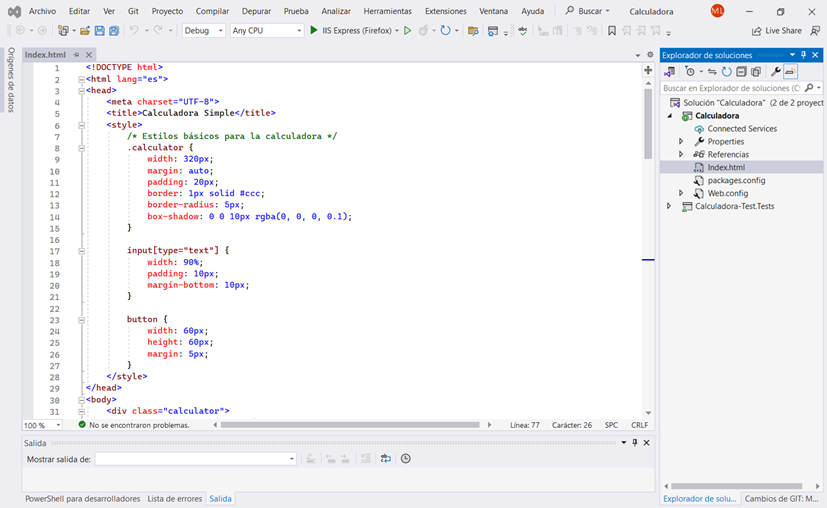
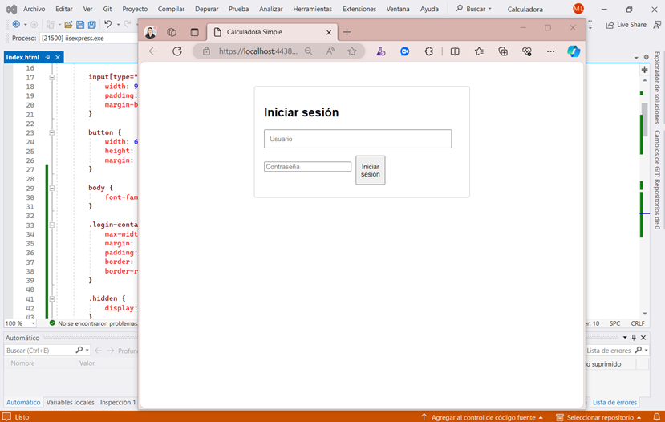
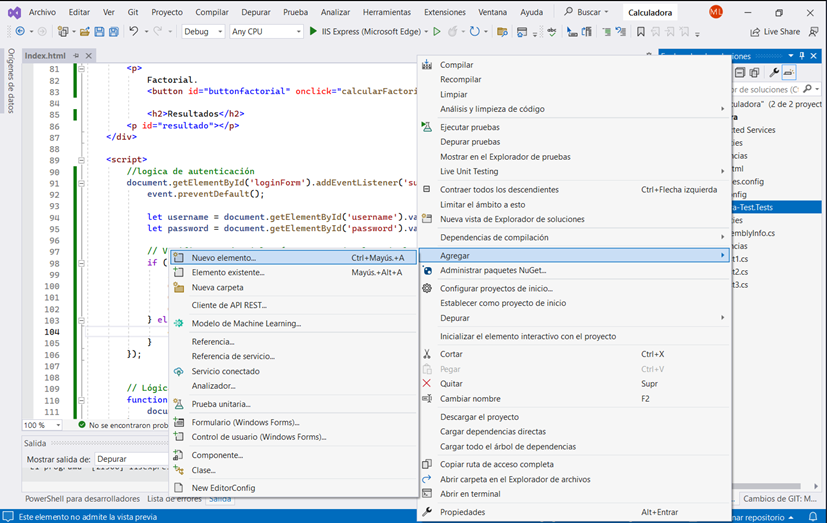
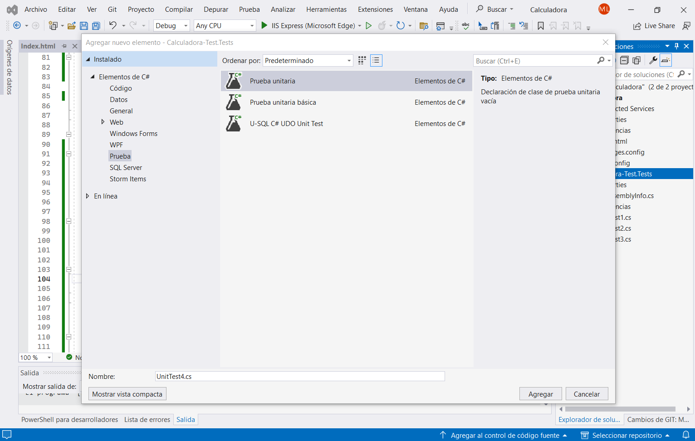

# CAPÍTULO 6. Pruebas de seguridad
## Práctica 6: Calculadora IV<br>
### Objetivo de la práctica:
Al finalizar la práctica, serás capaz de:<br>
* Validar si hay vulnerabilidades en aplicaciones web.
* Validar la autenticación y la vulnerabilidad de acceso con diferentes intentos de acceso.
### Duración aproximada:
30 minutos.<br>

# Instrucciones:

**1.** Accede a Visual Studio y abre el archivo *Index.html*.<br>

**1.1.** Selecciona todo el código, elimínalo y añade el siguiente:
```HTML
<!DOCTYPE html>
<html lang="es">
<head>
    <meta charset="UTF-8">
    <title>Calculadora Simple</title>
    <style>
        /* Estilos básicos para la calculadora */
        .calculator-container hidden {
            width: 320px;
            margin: auto;
            padding: 20px;
            border: 1px solid #ccc;
            border-radius: 5px;
            box-shadow: 0 0 10px rgba(0, 0, 0, 0.1);
        }
        input[type="text"] {
            width: 90%;
            padding: 10px;
            margin-bottom: 10px;
        }

        button {
            width: 60px;
            height: 60px;
            margin: 5px;
        }

        body {
            font-family: Arial, sans-serif;
        }

        .login-container, .calculator-container {
            max-width: 400px;
            margin: 50px auto;
            padding: 20px;
            border: 1px solid #ccc;
            border-radius: 5px;
        }

        .hidden {
            display: none;
        }
    </style>
</head>
<body>
    <div class="login-container">
        <h2>Iniciar sesión</h2>
        <form id="loginForm">
            <input type="text" id="username" placeholder="Usuario" required>
            <input type="password" id="password" placeholder="Contraseña" required>
            <button type="submit" id="submit">Iniciar sesión</button>
        </form>
    </div>

    <div class="calculator-container hidden" id="calculator">
        <h2>Calculadora básica:</h2>
        <input type="text" id="display" readonly>
        <br>
        <button id="button1" onclick="addToDisplay('1')">1</button>
        <button id="button2" onclick="addToDisplay('2')">2</button>
        <button id="button3" onclick="addToDisplay('3')">3</button>
        <button id="buttonsuma" onclick="addToDisplay('+')">+</button>
        <br>
```
**1.2.** Guarda los cambios y prueba que la aplicación funcione usando ***admin*** como usuario y contraseña.

**1.3.** Da clic derecho en las pruebas, después en **Agregar** y **Nuevo elemento**



**1.4.**	**Añade una prueba unitaria.**<br>
**1.4.1.**	 Añade el siguiente código, el cual se utilizará para validar el acceso a la calculadora usando usuario y contraseña incorrectos.

```h
using NUnit.Framework;
using OpenQA.Selenium;
using OpenQA.Selenium.Edge;
using System.Threading;
namespace CalculadoraTest4
{
    public class Test4
    {
        private readonly string site;

        public Test4()
        {
            //Sigue las indtrucciones para añadir la liga de acuerdo a tu computador
            site = "tu-sitio";
        }
        [Test]
        //Prueba para validar que abre la pag.
        public void TestMethod1()
        {
            string usuario1 = "usuario1";
            string contraseña1 = "contraseña1";
            using (var driver = new EdgeDriver())
            {
                try
                {
                    // Aquí puedes agregar tus aserciones o acciones adicionales si es necesario
                    // Para la instrucción 5 se elimina la información de aquí y se sustituye por el codigo mencionado
                    driver.Url = site;
                    Thread.Sleep(2000);
                    var element = driver.FindElement(By.Id("username"));
                    var element1 = driver.FindElement(By.Id("password"));
                    var element2 = driver.FindElement(By.Id("submit"));
                    var element3 = driver.FindElement(By.Id("button1"));
                    element.SendKeys(usuario1);
                    element1.SendKeys(contraseña1);
                    element2.Click();
                    Thread.Sleep(3000);
                    element3.Submit();
                    Thread.Sleep(3000);
                }
                finally
                {
                    driver.Quit();
                }
            }
        }
    }
}
```
**1.5. Añade una prueba unitaria.**<br>
**1.5.1.**	Añade el siguiente código, el cual se utilizará para validar el acceso a la calculadora usando usuario y contraseña correctos.

```h
using NUnit.Framework;
using OpenQA.Selenium;
using OpenQA.Selenium.Edge;
using System.Threading;

namespace CalculadoraTest5
{
    public class Test5
    {
        private readonly string site;

        public Test5()
        {
            //Sigue las indtrucciones para añadir la liga de acuerdo a tu computador
            site = "tu _sitio";
        }

        [Test]
        //Prueba para validar que abre la pag.
        public void TestMethod1()
        {
            string usuario1 = "admin";
            string contraseña1 = "1234";
            using (var driver = new EdgeDriver())
            {
                try
                {
                    // Aquí puedes agregar tus aserciones o acciones adicionales si es necesario
                    // Para la instrucción 5 se elimina la información de aquí y se sustituye por el codigo mencionado
                                        driver.Url = site;
                    Thread.Sleep(2000);
                    var element = driver.FindElement(By.Id("username"));
                    var element1 = driver.FindElement(By.Id("password"));
                    var element2 = driver.FindElement(By.Id("submit"));
                    var element3 = driver.FindElement(By.Id("button1"));
                    element.SendKeys(usuario1);
                    element1.SendKeys(contraseña1);
                    element2.Click();
                    Thread.Sleep(3000);
                    element3.Submit();
                    Thread.Sleep(3000);
                }
                finally
                {
                    driver.Quit();
                }
            }
        }
    }
}
```
**2.** Ejecuta las dos pruebas; una saldrá errónea y una correcta. 


**Solución o producto final:**<br>
Prueba errónea fallida y prueba con datos correctos aprobada: 
